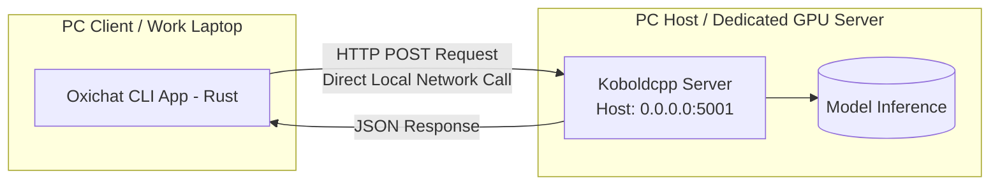

```markdown
# 🌊 Oxichat

An ultra-lightweight, high-performance, distributed Local AI CLI developer assistant. **Oxichat** operates as a native client that offloads heavy LLM inference workloads (e.g., Gemma, Qwen) to a dedicated local GPU host server running a Koboldcpp API endpoint, completely bypassing high local resource consumption.

To maximize performance, cross-platform compatibility, and extensibility, Oxichat is built using a **Multi-Language Hybrid Stack**: **Rust** (Core Orchestrator & UI), **C#** (Native AOT Text Processor), **TypeScript** (Standalone Context Plugins), and **Shell/PowerShell** (Deployment Automation).

---

## 🏗️ Architecture & Data Flow

Oxichat is designed as a single, unified system where components communicate directly via native memory invocation (**FFI**) or standalone binary execution, ensuring **zero network overhead** on the client side.



### Component Breakdown

1. **Core Engine (`ruin_app` - Rust):** Handles the main terminal REPL loop, asynchronous HTTP communication, session chat history (context window), and orchestrates native FFI bindings.
2. **Native Utility (`ruin_ext` - C# .NET 10 Native AOT):** Compiled directly into an unmanaged native library (`.dll`/`.so`) with no .NET runtime dependency. It processes high-throughput string operations, matches multi-line markdown syntax via regex, and injects ANSI terminal escape colors.
3. **Context Gatherer (`plugins` - TypeScript via Bun Compiler):** Compiled into a standalone executable. It inspects local workspace paths and safely reads codebases to dynamically stream context payloads back to the Rust core.
4. **Automation Glue (`scripts` - Shell & PowerShell):** Simplifies cross-platform compilation, linking, and deployment setups for both Windows and Linux environments.

---

## 📁 Repository Structure

```text
/Oxichat
  ├── /ruin_app           <-- Core CLI Engine (Rust)
  │    ├── /src
  │    │    └── main.rs   <-- REPL UI, Async HTTP Client & Dynamic FFI Linker
  │    └── Cargo.toml
  │
  ├── /ruin_ext           <-- Native AOT Helper Library (C#)
  │    ├── Processor.cs   <-- High-performance Regex Markdown Parser
  │    └── ruin_ext.csproj
  │
  ├── /plugins            <-- Standalone System Extractor (TypeScript)
  │    └── read_project.ts<-- Workspace Document Context Injector
  │
  └── /scripts            <-- Cross-Platform Build Scripts (Shell/PowerShell)
       ├── build.ps1      <-- Windows One-Click Build Pipeline
       └── install.sh     <-- Linux System Deployment Automation

```

---

## 🚀 Features

* **Distributed Topology:** Direct connection to any local network host. Runs smoothly on resource-constrained client machines.
* **Dynamic FFI Binding:** Runtime DLL/SO loading using `libloading` in Rust, preventing application crashes even if the extension module is missing.
* **Zero-Dependency Core Execution:** All compiled elements output completely native binaries. No local Node.js or .NET runtime installation required for the end-user.
* **Context Injection Engine:** Inject real-time workspace files directly into the AI's system prompt memory using the `/read <path>` macro.
* **ANSI Color Terminal Rendering:** Optimized multi-line regex formatting powered by .NET Native AOT compilation.

---

## 🔧 Installation & Compilation

### Prerequisites

* **Rust Compiler** (MSRV 1.75+)
* **.NET 10 SDK** (with C++ Desktop Development workloads configured for Native AOT)
* **Bun Runtime** (for compiling TypeScript plugins)

### Building on Windows

Run the automated build script from the root workspace directory via PowerShell:

```powershell
.\scripts\build.ps1

```

### Running the CLI Client

Execute the core binary from `ruin_app`, feeding the target host IP of your dedicated GPU backend:

```bash
cargo run -- --host <YOUR_GPU_HOST_IP> --dll-path "path/to/ruin_ext.dll"

```

---

## 💬 Usage Example

```text
========================================
🌊 Oxichat - Dynamic Local Distributed AI CLI
========================================

Kamu: /read Cargo.toml
 Membaca file menggunakan plugin native: Cargo.toml
 File berhasil digabungkan ke memori AI!

Kamu: What dependencies are configured in this project?
AI: Based on the Cargo.toml file provided, your project depends on:
    - reqwest (v0.12) with JSON support
    - tokio (v1) asynchronous backend runtime
    - libloading (v0.8) for dynamic native shared library invocation

```