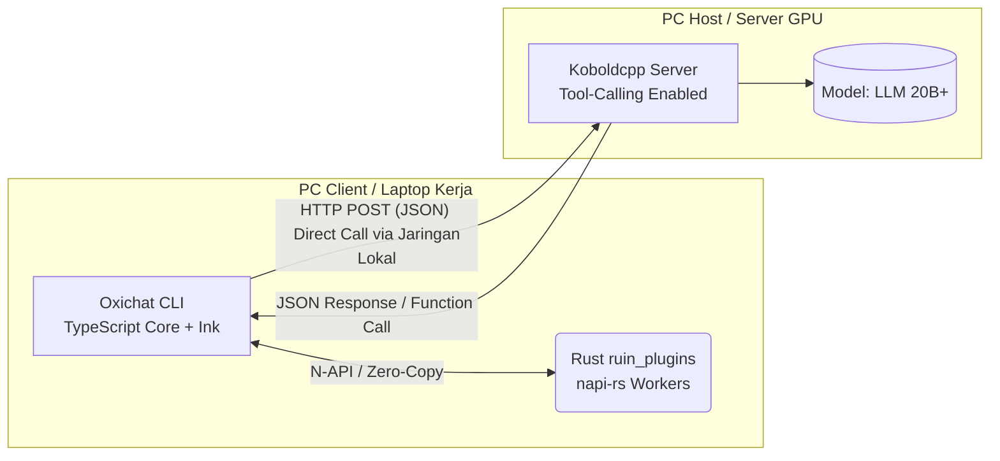

```markdown
# 🚀 Oxichat: Agentic CLI Architecture Plan

## 1. Arsitektur Jaringan & Alur Kerja Agentic

### A. Alur Komunikasi Jaringan
Aplikasi Client (Oxichat) berjalan sebagai Agen Otonom di atas Node.js/Bun. Aplikasi ini berkomunikasi dengan LLM secara langsung via HTTP POST dan menggunakan `napi-rs` untuk interaksi level sistem tanpa latensi FFI yang berbelit.



### B. Alur Eksekusi Agentic (Terinspirasi Claude Code)

Sistem bekerja dengan siklus *Reasoning & Action* (ReAct).

```text
[User Prompt: "Refaktor fungsi login di auth.ts"] 
     │
     ▼
┌────────────────────────────────────────────────────────────────────────┐
│ 🟦 oxichat_core (TypeScript) - BRAIN & ORCHESTRATOR                    │
│                                                                        │
│ 1. Render UI Terminal interaktif (Ink + Enquirer).                     │
│ 2. Terjemahkan prompt user menjadi format Tool-Calling (JSON).         │
│ 3. Panggil HTTP POST ke LLM untuk meminta "Rencana Tindakan".          │
│ 4. Terima instruksi eksekusi (misal: "Buka file auth.ts"). ────────────┼──┐
└────────────────────────────────────────────────────────────────────────┘  │
                                                                            │
     ┌──────────────────────────────────────────────────────────────────────┘
     ▼
┌────────────────────────────────────────────────────────────────────────┐
│ 🦀 oxi_ruin_plugins (Rust via napi-rs) - HIGH-PERFORMANCE WORKERS            │
│                                                                        │
│ 1. Fast I/O: Cari & baca `auth.ts` dalam hitungan milidetik.           │
│ 2. Git Context: Cek status `git diff` untuk konteks tambahan.          │
│ 3. Text Processing: Parsing AST atau Markdown dengan kecepatan native. │
│ 4. Kembalikan data mentah/hasil eksekusi ke TypeScript. ───────────────┼──┐
└────────────────────────────────────────────────────────────────────────┘  │
                                                                            │
     ┌──────────────────────────────────────────────────────────────────────┘
     ▼
[Looping kembali ke TypeScript untuk dievaluasi oleh LLM sampai tugas selesai]

```

---

## 2. Struktur Direktori Proyek

```text
/Oxichat
  ├── /ruin_core                 <-- Brain, UI, & Agent Logic (TypeScript)(ES Modules)
  │    ├── /src
  │    │    ├── index.ts    <-- Entry point, REPL loop
  │    │    ├── ui.tsx      <-- Komponen Terminal UI (Ink React)
  │    │    └── agent.ts    <-- Logika Tool Calling & LLM Routing
  │    └── package.json
  │
  ├── /ruin_plugins               <-- Native System Operations (Rust via napi-rs)
  │    ├── /src
  │    │    ├── lib.rs      <-- FFI Bindings Export
  │    │    ├── fs_fast.rs  <-- File reader & system crawler
  │    │    └── git_ops.rs  <-- Git status & history fetcher
  │    ├── Cargo.toml
  │    └── build.rs
  │
  └── /scripts              <-- Build Automation
       └── build_all.js     <-- Script kompilasi Rust & TS (Cross-platform)

```

---

## 3. Pembagian Tugas & Fitur ala Claude Code

### 1. TypeScript (`ruin_core`) - *Agentic Brain & UI*

* **Terminal Reactivity:** Menggunakan `ink` untuk me-render *progress bar*, status eksekusi *tools*, dan percakapan secara *real-time*. Menggunakan `enquirer` untuk konfirmasi *action* (misal: "Izinkan AI menjalankan perintah `npm install`? [Y/n]").
* **Agentic Loop:** Menangani logika *routing*. Jika LLM mengembalikan *function call* (seperti `read_file` atau `execute_bash`), TypeScript akan meneruskannya ke Rust atau Node.js standar, lalu mengirim hasilnya kembali ke LLM.
* **Context Window Management:** Mengelola riwayat token dan memangkas konteks obrolan agar tidak melebihi batas model.

### 2. Rust (`ruin_plugins`) - *Heavy System & Context Ops*

* **Deep Context Gatherer:** Mengitari seluruh folder proyek, membaca `.gitignore`, dan merangkum struktur proyek dalam hitungan milidetik.
* **Grep & Search Engine:** Fitur pencarian teks berkecepatan tinggi di dalam ratusan file untuk menemukan referensi kode yang dibutuhkan AI.
* **Syntax & Markdown Processor:** Memproses blok kode dari respon LLM dan menyuntikkan *ANSI escape codes* yang kompleks untuk *syntax highlighting* di terminal.

---

## 💻 4. Contoh Implementasi Komponen Utama

### A. Otot Rust (`ruin_plugins/src/lib.rs`)

Menggunakan `napi-rs` untuk operasi *file system* tingkat rendah yang dipanggil langsung oleh AI.

```rust
#![deny(clippy::all)]
use napi_derive::napi;
use std::fs;

#[napi]
pub fn agent_read_file(file_path: String) -> String {
    // Membaca file dengan sangat cepat untuk disuplai ke context LLM
    match fs::read_to_string(&file_path) {
        Ok(content) => format!("--- FILE: {} ---\n{}", file_path, content),
        Err(_) => format!("Error: Tidak dapat membaca file {}", file_path),
    }
}

#[napi]
pub fn fast_syntax_highlight(code: String) -> String {
    // Logika Rust untuk inject warna ANSI secara instan
    code.replace("function", "\x1b[35mfunction\x1b[0m")
}

```

### B. Otak TypeScript (`ruin_core/src/agent.ts`)

Mengatur interaksi UI dan *System Tools*.

```typescript
import { render } from 'ink';
import { agent_read_file, fast_syntax_highlight } from '../../ruin_plugins/index.js';
import { ChatUI } from './ui.js';

// Fungsi Tool-Calling yang di-expose ke LLM
async function handleLLMAction(actionType: string, payload: any) {
    if (actionType === 'read_file') {
        // Panggil Rust secara instan
        const fileContext = agent_read_file(payload.path);
        return fileContext;
    }
    
    if (actionType === 'execute_cmd') {
        // Logika untuk meminta izin ke user sebelum menjalankan perintah bahaya
        // ...
    }
}

// Render React di dalam terminal
render(<ChatUI />);

```

---

## 🏁 5. Checklist Deployment & Eksekusi

* [ ] **Inisialisasi NAPI:** Jalankan `npx @napi-rs/cli new` di dalam folder `ruin_plugins` untuk men-generate *boilerplate* yang benar.
* [ ] **Kompilasi Addon:** Pastikan `npm run build` di folder `ruin_plugins` berhasil menghasilkan file `.node` yang valid untuk OS host.
* [ ] **Server LLM:** Koboldcpp berjalan dengan model yang mendukung *Tool Calling* / *Function Calling* (misal: Llama 3 atau model Instruct spesifik).
* [ ] **Izin Sistem:** Pastikan aplikasi terminal memiliki *permission* untuk membaca/menulis file di *working directory*.

```

```